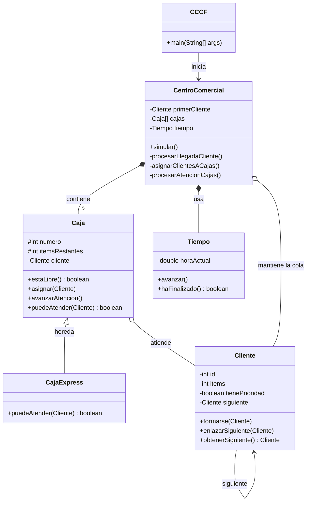

```mermaid
classDiagram
    class CCCF {
        +main(String[] args)
    }
    
    class CentroComercial {
        -Cliente primerCliente
        -Caja[] cajas
        -Tiempo tiempo
        +simular()
        -procesarLlegadaCliente()
        -asignarClientesACajas()
        -procesarAtencionCajas()
    }
    
    class Caja {
        #int numero
        #int itemsRestantes
        -Cliente cliente
        +estaLibre() boolean
        +asignar(Cliente)
        +avanzarAtencion()
        +puedeAtender(Cliente) boolean
    }
    
    class CajaExpress {
        +puedeAtender(Cliente) boolean
    }
    
    class Cliente {
        -int id
        -int items
        -boolean tienePrioridad
        -Cliente siguiente
        +formarse(Cliente)
        +enlazarSiguiente(Cliente)
        +obtenerSiguiente() Cliente
    }
    
    class Tiempo {
        -double horaActual
        +avanzar()
        +haFinalizado() boolean
    }

    CCCF --> CentroComercial : inicia
    CentroComercial *-- "5" Caja : contiene
    CentroComercial *-- Tiempo : usa
    CentroComercial o-- Cliente : mantiene la cola
    Caja <|-- CajaExpress : hereda
    Caja o-- Cliente : atiende
    Cliente --> Cliente : siguiente
```

